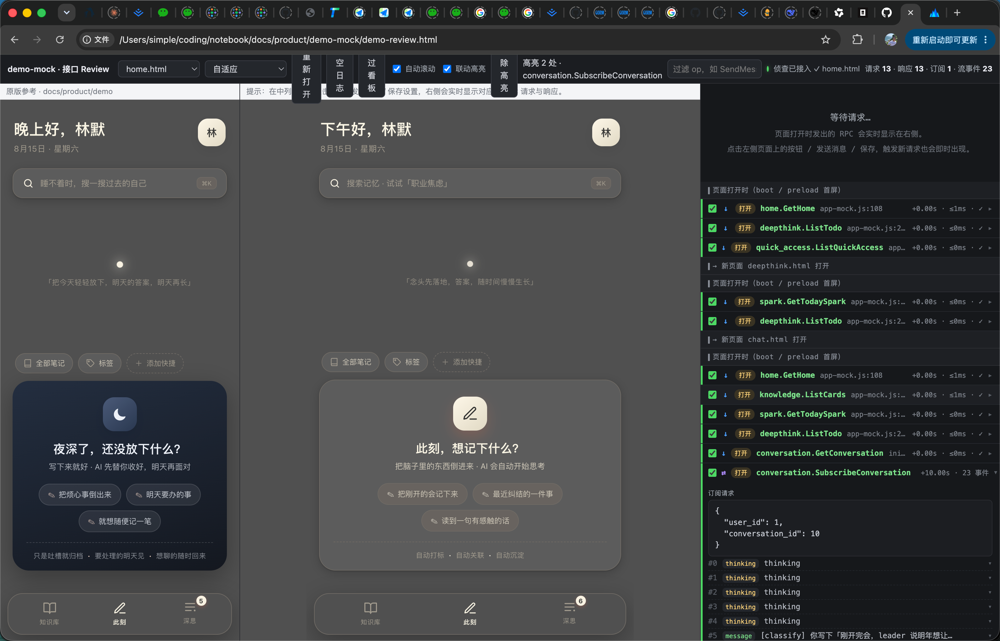

# simple-skills

simple 的个人效率自动化技能集，打包成 Claude Code 插件（marketplace）。

## 安装

方式一：通过 marketplace 安装（推荐，可后续从 GitHub 更新）

```bash
claude plugin marketplace add <owner>/simple-skills
claude plugin install simple@simple
```

方式二：本地路径调试安装（未推 GitHub 时用）

```bash
claude plugin marketplace add /Users/simple/coding/simple-skills
claude plugin install simple@simple
```

安装后命令前缀为 `simple`，例如 `/simple:init-docs`。

## 环境要求

- **Claude Code CLI ≥ 2.1.154**（2026-05 引入 Workflow）。使用 Workflow 驱动的 skill（`review` / `specs-api-mock` / `ucs-api` / `ucs-grpc` / `ucs-page` / `specs-ws` / `specs-design` 的 3B 每页模式 / `product-glossary` 的阶段 2）**硬性要求此版本**——低于它会因缺少 Workflow 工具而报错，不会降级回旧的 subagent 流程。
- **推荐 ≥ 2.1.248**：内置 `/workflow-authoring` 写作辅助 + 完整 ultracode 体验；至少 ≥ 2.1.203（`/effort ultracode` 模式）。
- **模型**：非硬性门槛。Workflow 子 agent 的模型解析链 = 脚本显式指定 → 子 agent frontmatter → `CLAUDE_CODE_SUBAGENT_MODEL` 环境变量 → 兜底主会话模型。若设置了 `CLAUDE_CODE_SUBAGENT_MODEL`，子 agent 会用它而非主模型（重活想用更强模型，可在 workflow 脚本的 `agent()` 里显式指定 `model`）。
- **权限**：调用带 Workflow 指令的 skill 即视为对多 agent 编排的显式 opt-in；首次运行可能弹权限提示，放行即可。

## 技能列表

按流水线阶段分组，命令前缀 `simple`（如 `/simple:init-docs`）。

流水线：**产品思考 → 技术架构与标准 → 数据/接口/协议定义 → 用例规约 → 执行落地 → 质量与部署**

> 状态列：✅ = 已自测（在真实项目跑通过）；未标注的为待验证。

### 产品思考

| 命令 | 说明 | 状态 |
| --- | --- | --- |
| `/simple:demo` | 产品思考梳理 + 风格化页面 demo（sense.md + HTML demo） | ✅ |
| `/simple:specs-design` | 设计元素提取：按 design.md 规范从 demo 提取设计系统（色板/字体/字号/间距/圆角/阴影/组件）→ docs/specs/design/DESIGN.md | ✅ |
| `/simple:specs-components` | 组件提取：demo 页面可复用视觉单元归类为规范组件 → docs/specs/design/COMPONENTS.md + component-map-rule.md（跨端组件映射表） | |
| `/simple:product-business` | 基于 sense.md + demo 原型稿，用四色建模法梳理业务流程（business-flow.md） | ✅ |
| `/simple:product-glossary` | 统一语言词汇表：business-flow → glossary.md，subagent 逐页对比 demo，分歧/缺失处理 | ✅ |

### 技术架构与标准

| 命令 | 说明 | 状态 |
| --- | --- | --- |
| `/simple:architecture` | 技术选型：选端→选技术栈（带推荐）→后端定架构→构造选型 prompt 输出 tech-stack-rule/draft | ✅ |
| `/simple:standards-directory` | 目录结构设计：读 architecture 选型→按架构风格选模板（DDD/扁平切片/MVC/OOP）→输出 directory-rule/draft | ✅ |
| `/simple:standards-http` | HTTP handler 请求流转说明（仅后端）：按架构风格选模板，输出 http-handler-rule/draft | ✅ |
| `/simple:standards-tools` | 工具层设计（通用）：按端+架构风格选模板，输出 tools-rule/draft | ✅ |
| `/simple:standards-task` | 异步任务层选型（仅后端）：候选对比+架构决策 → task-layer-rule/draft | ✅ |

### 数据 / 接口 / 协议定义

| 命令 | 说明 | 状态 |
| --- | --- | --- |
| `/simple:specs-db` | 数据库设计：选 DB 类型（推荐），MySQL 9 条规范生成 table.sql，其他 DB 适配 | ✅ |
| `/simple:specs-data` | 数据结构定义：可靠性视角识别显式结构（DB JSON/跨接口共享/载荷/外部契约）→ struct.md | |
| `/simple:specs-api` | 接口定义：选 HTTP(OpenAPI3.0 → docs/specs/API/) / gRPC(proto3 → docs/specs/grpc/)；HTTP 再选标准 RESTful 或只用 GET/POST；顺序 subagent 逐页生成，按模块合并 | ✅ |
| `/simple:specs-api-mock` | 接口 Mock 层生成 + demo 接线 + 满足度对照：契约子 agent 按接口定义（gRPC/HTTP）生成 api-mock.js（契约字段、流式订阅、状态化 store，demo 真实数据 1:1 播种）→ 并行页面对照（数据访问 → RPC/字段，covered/未接线/gap/pure_client）→ 单写接线复制页面换脚本全走 api-mock + 接口格式校验循环 → 汇总写 docs/specs/review/mock-compare.md 人话决策单（含跨接口总览，demo-mock/ file:// 直开）。取代已退役的 specs-api-review | ✅ |
| `/simple:specs-ws` | WS 协议定义（AsyncAPI 2.6，仅后端）：识别实时通道→顺序 subagent 生成 → docs/specs/ws/ | |

### 用例规约（UCS）

| 命令 | 说明 | 状态 |
| --- | --- | --- |
| `/simple:ucs-api` | 接口用例规约 UCS（仅后端）：三阶段 Workflow pipeline（生成→审查→修正，逐模块并行）生成 UCS → API-UCS，6 维安全审查 → API-UCS-review，修正写回 | ✅ |
| `/simple:ucs-grpc` | gRPC 接口用例规约 UCS（仅后端）：三阶段 Workflow pipeline（生成→审查→修正，逐模块并行）生成 UCS → grpc-UCS，6 维安全审查 → grpc-UCS-review，修正写回 | ✅ |
| `/simple:ucs-page` | 页面用例规约 Page UCS（仅写页面端）：确定性切片后 Workflow 逐页并行子 agent 生成页面公约 → docs/specs/page-UCS/<页面>.md | ✅ |
| `/simple:ucs-task` | 异步任务用例规约 task-UCS（仅后端）：business-flow 梳理 + grilling 逐任务探讨→生成 task-UCS | ✅ |
| `/simple:ucs-ws` | WS 通道用例规约 WS-UCS（仅后端）：识别通道 + grilling 逐通道探讨→生成 → docs/specs/ws-UCS/ | |

### 执行落地

| 命令 | 说明 | 状态 |
| --- | --- | --- |
| `/simple:init-docs` | 初始化项目文档目录结构（docs/ 完整子目录树） | ✅ |
| `/simple:do-directory` | 目录脚手架搭建（执行型）：读 standards 文档创建目录树 + 基础文件 | ✅ |
| `/simple:do-db` | DB 初始化（仅后端，执行型）：按 specs/data 建库建表，禁 DROP、只建 spec 内的表 | ✅ |
| `/simple:do-api` | 接口编码+测试（仅后端，执行型）：两阶段——先顺序 subagent 实现所有 UCS→编译通过，再顺序 subagent 写测试→更新测试脚本 | |
| `/simple:do-grpc` | gRPC 服务编码+测试（仅后端，执行型）：两阶段——先顺序 subagent 实现所有 grpc-UCS→编译通过，再顺序 subagent 写测试→更新测试脚本 | ✅ |
| `/simple:do-task` | 异步任务编码+测试（仅后端，执行型）：两阶段——先顺序 subagent 实现所有 task-UCS→编译通过，再顺序 subagent 写测试 | ✅ |
| `/simple:do-ws` | WS 网关编码+测试（仅后端，执行型）：两阶段——先顺序 subagent 实现 UCS-ws→编译通过，再顺序 subagent 写测试 | |
| `/simple:do-page` | 页面开发（仅写页面端，执行型）：盘点 page-UCS→顺序 subagent 按公约+demo+API 实现→编译通过 | |

### 质量与部署

| 命令 | 说明 | 状态 |
| --- | --- | --- |
| `/simple:tdd` | 测试全绿修复：跑全量测试→逐失败修复（修代码不修测试）→重跑→直到全部通过 | |
| `/simple:review` | 代码质量审查（只报告，不改代码）：接口维度（DB 效率/安全/错误处理/契约漂移）+ 全库维度（环调用/孤儿代码/硬编码）→ 分级写 docs/review/issues.md，P0 对话呈现 | |
| `/simple:review-fix` | 按 issues.md 整改（执行型）：读 issues.md 与用户探讨范围/方案→登记任务（TaskCreate）顺序 subagent 修复→整体构建→归档 docs/review/ 到 archiving/{今日日期} | |
| `/simple:docker` | Docker 容器化部署：生成 Dockerfile/compose/readme-docker.md，覆盖日志/资源/卷/环境/DB 初始化 | |

## specs-api-mock 详解

接口 Mock 层生成 + demo 接线：把 demo 的真实数据按项目接口定义 **1:1** 做成 JS mock，复制页面到 `demo-mock` 并全部改走 mock 接口层，再逐页对照差异，产出确定性的满足度结论。

**解决什么问题**：前端在真实后端就绪前，需要可运行、数据贴合的 mock 来做接口联调预演；同时要判断「接口定义到底覆盖了多少 demo 数据访问、哪些还没接口」。

**三阶段 Workflow pipeline**：

- **生成**：契约子 agent 读全部接口定义（gRPC proto / HTTP yaml）生成 `api-mock.js`（契约字段命名、流式接口订阅推送、状态化 store + localStorage/window.name 镜像），数据从 demo 实际数据按「demo 字段 → 契约字段」映像播种。
- **对照**：逐业务页把数据访问映射到契约 RPC/字段，得出 covered / 未接线 / gap / pure_client，写决策单 `docs/specs/review/mock-compare.md`。
- **接线**：单写复制页面、换脚本全走 api-mock.js；独立校验子 agent 逐调用点核对格式（op 存在性 / 请求·响应字段 ⊆ 契约 / 流式用 `.subscribe`），不一致循环修正到 clean。
- **接口 Review 看板**：自动生成三列看板（原版 demo 参考 / demo-mock 业务页 / 实时 RPC 流量），点击接口联动高亮对应内容区、对照 proto 做格式校验、打勾「符合预期」+ 按 proto 文件聚合的「通过看板」——模板化，任何项目通用。

产物 `docs/product/demo-mock/` 可 file:// 直开，无服务器、无网络。本 skill 已并入退役的 `specs-api-review`。



## 工作流：为什么先文档、后编码

这条流水线的核心是**先想清楚、再动手写**：产品 demo → 规范文档（架构/标准/数据/接口/用例 UCS）→ 执行落地（do-*）→ 质量闭环（tdd/review）。所有「做」的 skill 只消费上游「想」的 skill 产物，编码是流水线的最后一步，而不是第一步。

**为什么这么设计**

- **AI 没有跨会话记忆**：每次会话都是「从零开始」。产物落盘到 `docs/` 成为唯一事实源，subagent 读文档干活，而不是每次重新想、重新编。
- **编码前定契约**：接口 / 数据结构 / 组件 / 目录树先在文档里定死，改需求只改文档，不返工改代码。
- **防模型自由发挥**：每个 skill 带前置依赖硬检查（缺产物就停、提示先跑上游）；执行型 skill 从 spec 提取「确定清单」，不许自行增删（如 `do-db` 只建 spec 内的表、绝不 DROP）。
- **上下文有限**：顺序 subagent + 逐页切片，一次只喂一部分，避免一次塞进整个项目导致质量下降。
- **批处理用 Workflow 编排**：`review` / `specs-api-mock` / `ucs-api` / `ucs-grpc` / `ucs-page` / `specs-ws` / `specs-design`（3B）/ `product-glossary`（阶段2）的批量阶段改为 Workflow 驱动（脚本在 `skills/<name>/scripts/*.workflow.js`：并行子 agent + schema 结构化返回 + 汇总 agent），主进程只收集参数、启动 workflow、等通知后读产物报告；交互闸门（AskUser 范围 / 文件已存在）仍在主进程。仅适用于「每项独立、无共享写」的批处理；`do-*` 等共享代码库的 skill 保持顺序。
- **质量前置**：先写 UCS 验收用例，再做实现；最后 tdd 全绿 + review 审查 + review-fix 整改闭环。

**好处**

- **少返工**：先想清楚再编码，改需求改文档而非改代码。
- **可并行**：契约先行，前端/后端/各端可并行开发。
- **可审计**：`docs/` 完整留档，UCS 即验收用例，review 留 issues.md。
- **可复用**：组件 / 设计系统 / 接口规范沉淀，跨项目、跨端复用。
- **可交接**：新人或另一个 AI 读 `docs/` 即可接手。

## 最佳实践顺序（按视角）

> 完整流水线见上方技能列表；按视角选择执行路径。命令前缀 `simple`。

### 0. 初始化（所有场景前置）

`init-docs` — 初始化项目文档目录结构（docs/ 完整子目录树）。幂等、绝不破坏已有内容，所有场景的第一步都从它开始。

#### 目录结构

    docs/
    ├── misc/           与项目开发无关的文档（会议纪要、随手记等）
    ├── plans/          Claude Code 的 plan 生成文档存储目录
    ├── product/        产品原型相关文档（sense.md、demo、glossary 等）
    ├── specs/
    │   ├── API/        接口协议文档（OpenAPI3.0）
    │   ├── ws/         WS 协议文档（AsyncAPI 2.6）
    │   ├── data/       数据结构及 DB 设计协议（struct.md、table.sql）
    │   ├── API-UCS/    接口描述用户规约（验收用例）
    │   ├── ws-UCS/     WS 协议描述用户规约
    │   ├── task-UCS/   异步任务描述用户规约
    │   └── tools-UCS/  工具层描述用户规约
    ├── standards/      技术架构文档（约束层：AI 编码执行依据）
    ├── templates/      项目参考模板（「抄哪个样板」）
    └── prompt/         项目特有提示词

#### 理念

`init-docs` 定下的不是「文档放哪」，而是**「契约放哪、约束放哪」**——它是整条流水线的地基：

- **docs/ 是唯一事实源**：AI 没有跨会话记忆，所有「想」的产物（产品/规格/UCS）固定落盘，subagent 读文档干活，不重新想、不重编。
- **目录即流水线**：目录与流水线阶段一一对应——`product`（想清楚做什么）→ `specs`（定死契约）→ `standards`（怎么做）→ 执行型 skill（do-*）只消费这些目录。
- **契约与约束分层**：`specs/` 定「做什么」（数据/接口/协议 + 验收 UCS），`standards/` 定「怎么做」（架构约束），`templates/` 给「抄哪个样板」——改需求只改 specs，改规范只改 standards，互不干扰。
- **约束可追溯**：`docs/standards/CLAUDE.md` 是 AI 编码时的执行依据；约束用 `-rule.md`（直接照做）/ `-draft.md`（决策留痕）成对维护。
- **幂等、绝不破坏**：只创建缺失的目录与模板，不删除、不重命名、不覆盖已有内容——初始化安全，可随时重跑。

### 1. 单纯产品视角

只需 `demo` — 产品思考梳理 + 风格化页面 demo，产出 sense.md + HTML demo 即可。
如需把 demo 的设计沉淀为规范文档，追加 `specs-design` — 提取设计系统到 docs/specs/design/DESIGN.md。

### 2. 后端开发视角（完成 demo 后）

product-business → product-glossary → specs-db → specs-api → architecture → specs-data → standards-directory → standards-http → standards-tools →（如需）standards-task → do-directory → do-db → ucs-api →（如需）ucs-task → do-api →（如需）do-task → tdd → docker

> gRPC 后端：specs-api 选 gRPC 后，把 `ucs-api` → `ucs-grpc`、`do-api` → `do-grpc`。

### 3. 前端开发视角（完成 demo 后）

product-business → specs-design（提取设计系统）→ do-directory →（将后端 api 文档放入前端目录）→ ucs-page → do-page → 调通后让 AI 把 mock 切换为正式接口

### 4. 小程序

类似前端（复用前端开发视角的执行路径）。

### 5. 客户端

待实践。

## 开发

- 新增 skill：在 `skills/<skill-name>/SKILL.md` 写 frontmatter（`name`、`description`）+ 指令正文，并把路径加进 `.claude-plugin/plugin.json` 的 `skills` 数组。
- 校验清单：`claude plugin validate .`
- 发布：推到 GitHub 后 `claude plugin tag .` 打版本标签。

## 致谢与灵感

本仓库借鉴了以下开源项目与内容，在此致谢：

- [gstack（garrytan/gstack）](https://github.com/garrytan/gstack) — `demo` 技能（Phase 1）：前提挑战（Premise Challenge）、对抗式审查、完成度门禁、结论循环等思考机制，参考了其 `plan-ceo-review` 的思考姿势。
- [grill-me（mattpocock/skills）](https://github.com/mattpocock/skills) — `demo` 技能（Phase 1）：一问一答、每问附推荐答案、「事实靠查、决策靠问」的 grilling 模式源自其 grill-me 技能。
- [taste-skill（leonxlnx/taste-skill）](https://github.com/leonxlnx/taste-skill) — `demo` 技能（Phase 2）：AI 味黑名单（`rules/ai-tells.md`）与性能/无障碍护栏（`rules/guardrails.md`），参考了其「给 AI 好审美、拒绝默认 AI 味」的思路。
- 小红书 up 主 jpg（ID 490407598，120303469@qq.com）— `demo` 技能（Phase 2）：配色池（`palettes/`）的配色内容来自其分享。

感谢这些作者与创作者的探索与分享。
